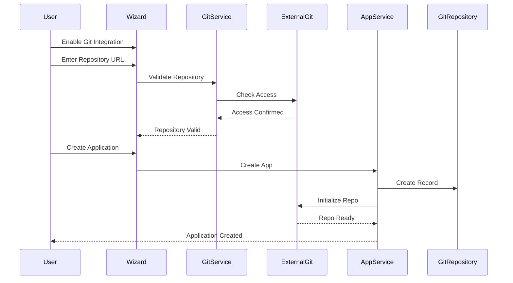
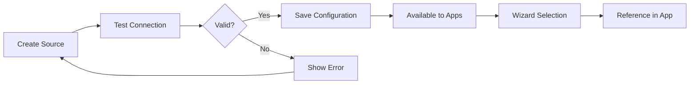

# Application Creation Wizard - Comprehensive Guide
**Version:** 1.0.0
**Date:** December 28, 2025
**Feature Status:** ✅ Production Ready

---

## Table of Contents
1. [Overview](#overview)
2. [Features](#features)
3. [Wizard Steps](#wizard-steps)
4. [Templates](#templates)
5. [Git Integration](#git-integration)
6. [Access Control](#access-control)
7. [Theming](#theming)
8. [Data Sources & Queries](#data-sources--queries)
9. [API Reference](#api-reference)
10. [User Guide](#user-guide)
11. [Developer Guide](#developer-guide)

---

## Overview

The **Application Creation Wizard** is a comprehensive 7-step guided interface that allows users to quickly create new low-code applications with full configuration options including version control, git integration, access permissions, themes, and data sources.

### Why the Wizard?

The original "New Application" modal had only 3 basic fields:
- ❌ No version management
- ❌ No git integration
- ❌ No permission configuration
- ❌ No theme selection
- ❌ No ability to clone existing apps
- ❌ No data source pre-selection

The new wizard addresses all these limitations and more.

### Key Benefits

✅ **Fast Application Creation** - Get started in minutes with templates
✅ **Version Control from Day 1** - Set initial version and increment strategy
✅ **Git Integration** - Connect to repositories during setup
✅ **Permission Planning** - Configure roles and access before launch
✅ **Visual Theming** - Choose from professional themes
✅ **Data Reuse** - Import existing data sources and queries
✅ **Application Cloning** - Create new versions from existing apps

---

## Features

### Multi-Step Workflow

The wizard guides users through 7 logical steps:

```
1. Template Selection  → Choose starting point
2. Basic Settings      → Name, version, description
3. Git Integration     → Repository setup
4. Access Control      → Roles, groups, permissions
5. Theme Selection     → Visual styling
6. Data Sources        → Import existing data connections
7. Review & Create     → Final confirmation
```

### Progressive Disclosure

- Only shows relevant fields based on previous selections
- Clone options appear only when cloning
- Git fields hidden unless enabled
- Empty states for optional features

### Smart Defaults

- **Version:** 1.0.0 (semantic versioning)
- **Status:** Draft (safe default)
- **Theme:** Exprsn Default (professional blue)
- **Color:** #0078D4 (Exprsn brand color)
- **Git Branch:** main
- **Roles:** Admin, Editor, Viewer (common RBAC)

### Validation & UX

- Real-time field validation
- Helpful error messages
- Color-coded progress indicator
- Back navigation allowed
- Keyboard shortcuts (Enter, Escape)
- Toast notifications

---

## Wizard Steps

### Step 1: Template Selection

**Purpose:** Choose how to start building your application

**Options:**

| Template | Description | Use Case |
|----------|-------------|----------|
| **Blank Application** | Empty canvas | Full creative control |
| **CRM Template** | Customer management | Sales, support teams |
| **Inventory Manager** | Stock tracking | Warehouses, retail |
| **Project Management** | Tasks & milestones | Team collaboration |
| **Clone Existing** | Copy from another app | New version, iteration |

#### Clone Options

When selecting "Clone Existing", configure what to copy:

- ✅ **Entities** - Database schema and field definitions
- ✅ **Forms** - Form layouts and validations
- ⬜ **Data** - Actual records (off by default)
- ⬜ **Workflows** - Automation rules
- ⬜ **Permissions** - Role configurations

**★ Insight ─────────────────────────────────────────────────────**
Cloning entities and forms without data creates a "template" - perfect for creating multiple similar applications (e.g., one CRM per client). Cloning WITH data is useful for creating test environments or yearly archives.
**─────────────────────────────────────────────────────────────────**

---

### Step 2: Basic Settings

**Purpose:** Define core application metadata

**Fields:**

| Field | Type | Required | Validation |
|-------|------|----------|------------|
| Application Name | Text | Yes | `^[a-zA-Z][a-zA-Z0-9_-]*$` |
| Display Name | Text | Yes | Any |
| Description | Textarea | No | Max 10,000 chars |
| Initial Version | Text | Yes | `^\d+\.\d+\.\d+$` |
| Initial Status | Select | Yes | draft/active |
| Icon | Text | No | Font Awesome class |
| Color | Color Picker | No | Hex code |

#### Auto-Generation

The wizard **automatically generates** the application name from the display name:
- "My CRM System" → `my-crm-system`
- "Sales Dashboard" → `sales-dashboard`
- Removes special characters, ensures starts with letter

#### Color Presets

5 curated color presets:
- 🔵 **Exprsn Blue** - #0078D4 (default)
- 🟣 **Purple** - #7C3AED
- 🔴 **Red** - #DC2626
- 🟢 **Green** - #059669
- 🟠 **Orange** - #EA580C

**★ Insight ─────────────────────────────────────────────────────**
Semantic versioning (MAJOR.MINOR.PATCH) allows you to signal breaking changes (major), new features (minor), and bug fixes (patch). Start at 1.0.0 for production-ready apps or 0.1.0 for prototypes.
**─────────────────────────────────────────────────────────────────**

---

### Step 3: Git Integration

**Purpose:** Connect application to version control system

**Configuration:**

```javascript
{
  gitEnabled: boolean,
  gitRepository: string,      // URL
  gitBranch: string,          // Default: 'main'
  gitStrategy: enum,          // gitflow | trunk | feature
  autoCommit: boolean,        // Auto-commit on publish
  enableCiCd: boolean         // Trigger pipelines
}
```

#### Branching Strategies

| Strategy | Description | Best For |
|----------|-------------|----------|
| **Git Flow** | feature/* → develop → main | Large teams |
| **Trunk-Based** | All commits to main | Small teams, CI/CD |
| **Feature Branches** | feature/* → main | Medium teams |

#### Auto-Commit Behavior

When enabled:
1. User publishes application
2. System auto-commits to git
3. Commit message: `chore: publish v{version}`
4. Includes metadata about changes

**★ Insight ─────────────────────────────────────────────────────**
Enable git integration from the start for automatic version history, collaboration, and deployment automation. You can always disable it later, but retroactive git history is impossible.
**─────────────────────────────────────────────────────────────────**

---

### Step 4: Access Control

**Purpose:** Define who can access the application

**Configuration:**

```javascript
{
  visibility: enum,           // private | organization | public
  roles: string[],            // Initial roles to create
  userGroups: string[]        // Groups with access
}
```

#### Visibility Levels

| Level | Description | Access |
|-------|-------------|--------|
| **Private** | Owner only | Creator can see/edit |
| **Organization** | Company-wide | All org members can view |
| **Public** | Everyone | Internet-accessible |

#### Default Roles

The wizard pre-selects 3 common roles:

**Administrator**
- Full access to all features
- Can modify settings, roles, permissions
- Can delete application

**Editor**
- Can create and edit records
- Cannot modify settings or structure
- Cannot delete application

**Viewer**
- Read-only access to records
- Cannot create or edit
- Can export data

**★ Insight ─────────────────────────────────────────────────────**
Start with the default 3 roles for 80% of use cases. You can always add specialized roles later (e.g., "Approver", "Auditor"). Keep role hierarchies simple to avoid confusion.
**─────────────────────────────────────────────────────────────────**

---

### Step 5: Theme Selection

**Purpose:** Choose visual appearance

**Available Themes:**

| Theme | Primary Color | Style | Use Case |
|-------|---------------|-------|----------|
| **Exprsn Default** | Blue (#0078D4) | Professional | Business apps |
| **Material Design** | Purple (#6200EA) | Modern | Consumer apps |
| **Nord** | Blue-gray (#5E81AC) | Minimal | Developer tools |
| **Dracula** | Purple (#BD93F9) | Dark | Long sessions |
| **High Contrast** | Black/Yellow | Accessible | Accessibility |
| **Custom Theme** | Variable | Flexible | Unique branding |

#### Theme Structure

Each theme defines:

```javascript
{
  name: "exprsn-default",
  colors: {
    primary: "#0078D4",
    secondary: "#6C757D",
    success: "#28A745",
    danger: "#DC3545",
    warning: "#FFC107",
    info: "#17A2B8"
  },
  typography: {
    fontFamily: "'Segoe UI', system-ui, sans-serif",
    fontSize: { base: "16px", heading: "24px" }
  },
  spacing: { unit: 8, scale: [0, 0.5, 1, 1.5, 2, 3, 4, 6, 8] },
  borderRadius: { sm: "4px", md: "8px", lg: "12px" }
}
```

**★ Insight ─────────────────────────────────────────────────────**
Choose "High Contrast" if accessibility compliance (WCAG 2.1 AA) is required. Material Design works best for mobile-responsive apps. Exprsn Default is safest for corporate environments.
**─────────────────────────────────────────────────────────────────**

---

### Step 6: Data Sources & Queries

**Purpose:** Import existing data connections

**Data Source Types:**

All 13 supported source types are available:
- PostgreSQL databases
- REST APIs
- Forge CRM/ERP data
- Redis cache
- JSON/XML files
- Plugins

**Selection Interface:**

```
┌─────────────────────────────────────┐
│ ☐  [📊] Production Database         │
│     POSTGRESQL                       │
├─────────────────────────────────────┤
│ ☑  [🔌] Stripe API                  │
│     REST                             │
├─────────────────────────────────────┤
│ ☐  [🗄️] Redis Cache                 │
│     REDIS                            │
└─────────────────────────────────────┘
```

**Benefits:**

- ✅ Avoid recreating existing connections
- ✅ Reuse tested configurations
- ✅ Share data across applications
- ✅ Pre-populate entity options

**★ Insight ─────────────────────────────────────────────────────**
Selecting data sources here doesn't copy them - it creates references. Multiple apps can share one data source connection. Changes to the source configuration affect all referencing apps.
**─────────────────────────────────────────────────────────────────**

---

### Step 7: Review & Create

**Purpose:** Final confirmation before creation

**Summary Sections:**

1. **Basic Information**
   - Template type
   - Application name
   - Version
   - Status

2. **Git Integration**
   - Enabled/disabled
   - Repository URL
   - Branch name

3. **Access & Security**
   - Visibility level
   - Initial roles
   - User groups

4. **Customization**
   - Selected theme
   - Data sources count
   - Queries count

**Actions:**

- **← Previous** - Go back to edit
- **Cancel** - Abort creation
- **Create Application** - Execute creation

---

## Templates

### Template Architecture

Templates are **JSON definitions** stored in the database or file system:

```javascript
{
  "id": "crm-template",
  "name": "CRM Template",
  "description": "Customer relationship management",
  "icon": "fa-users",
  "category": "business",
  "entities": [
    {
      "name": "contacts",
      "displayName": "Contacts",
      "fields": [
        { "name": "firstName", "type": "string", "required": true },
        { "name": "lastName", "type": "string", "required": true },
        { "name": "email", "type": "email", "unique": true },
        { "name": "phone", "type": "phone" },
        { "name": "company", "type": "string" }
      ],
      "indexes": [
        { "fields": ["email"] },
        { "fields": ["lastName", "firstName"] }
      ]
    },
    {
      "name": "deals",
      "displayName": "Deals",
      "fields": [
        { "name": "title", "type": "string", "required": true },
        { "name": "value", "type": "currency", "required": true },
        { "name": "stage", "type": "enum", "options": ["prospecting", "qualification", "proposal", "negotiation", "closed_won", "closed_lost"] },
        { "name": "contactId", "type": "reference", "references": "contacts" },
        { "name": "closeDate", "type": "date" }
      ]
    }
  ],
  "forms": [
    {
      "name": "contact-form",
      "displayName": "Contact Form",
      "entity": "contacts",
      "layout": { /* ... */ }
    }
  ]
}
```

### Creating Custom Templates

**Location:** `src/exprsn-svr/lowcode/templates/`

**Steps:**

1. Create JSON file: `my-template.json`
2. Define entities, forms, workflows
3. Add to template registry
4. Restart server

**Best Practices:**

- Keep templates simple and focused
- Provide good defaults
- Include sample data (optional)
- Document required fields
- Test thoroughly

---

## Git Integration

### Repository Connection Flow



### Auto-Commit Behavior

**Trigger:** Application publish event

**Commit Message Format:**

```
chore: publish v{version}

- Application: {displayName}
- Previous Version: {oldVersion}
- New Version: {newVersion}
- Entities: {entityCount}
- Forms: {formCount}
- Published By: {userEmail}

🤖 Generated with Exprsn Low-Code Platform
Co-Authored-By: Exprsn <noreply@exprsn.io>
```

**Files Committed:**

- `schema.json` - Entity definitions
- `forms/*.json` - Form configurations
- `workflows/*.json` - Workflow definitions
- `metadata.json` - Application metadata
- `CHANGELOG.md` - Version history

### CI/CD Integration

When **Enable CI/CD Pipeline** is checked:

1. Git webhook created automatically
2. Listens for push events
3. Triggers pipeline on main branch
4. Executes: test → build → deploy

**Default Pipeline:**

```yaml
# .exprsn/pipeline.yml
name: Deploy Application
on:
  push:
    branches: [main]

jobs:
  deploy:
    runs-on: exprsn-runner
    steps:
      - name: Checkout
        uses: actions/checkout@v3

      - name: Validate Schema
        run: npm run validate:schema

      - name: Run Tests
        run: npm test

      - name: Deploy to Staging
        if: success()
        run: npm run deploy:staging

      - name: Deploy to Production
        if: github.ref == 'refs/heads/main'
        run: npm run deploy:production
```

---

## Access Control

### Permission Model

Exprsn uses **Attribute-Based Access Control (ABAC)**:

```javascript
{
  subject: { userId: "uuid", roles: ["editor"] },
  action: "update",
  resource: { type: "entity", entityName: "contacts", recordId: "uuid" },
  context: { time: "2025-12-28T10:00:00Z", ip: "192.168.1.1" }
}
```

### Role Hierarchy

```
Administrator (Priority: 100)
    ├── Can do everything
    │
    ├── Editor (Priority: 50)
    │   ├── Can create records
    │   ├── Can update records
    │   ├── Can delete own records
    │   │
    │   └── Viewer (Priority: 10)
    │       ├── Can read records
    │       └── Can export data
```

### Group Management

**User Groups** enable bulk permission management:

```javascript
{
  name: "sales-team",
  displayName: "Sales Team",
  members: ["user1", "user2", "user3"],
  defaultRole: "editor",
  permissions: {
    entities: {
      contacts: { read: true, write: true },
      deals: { read: true, write: true },
      invoices: { read: true, write: false }
    }
  }
}
```

**Benefits:**

- Assign permissions once, apply to many
- Onboard new users faster
- Maintain consistent access policies
- Audit group membership

---

## Theming

### Theme Application

Themes are applied at **three levels**:

1. **Platform Level** - Default for all apps
2. **Application Level** - Selected in wizard
3. **Form Level** - Override for specific forms

**Cascade:**

```
Platform Theme
    ↓
Application Theme (wizard selection)
    ↓
Form Theme (optional override)
```

### CSS Variable Mapping

When a theme is selected, these CSS variables are set:

```css
:root {
  /* Colors */
  --primary: #0078D4;
  --primary-dark: #005A9E;
  --primary-light: #E6F2FA;

  --secondary: #6C757D;
  --success: #28A745;
  --danger: #DC2626;
  --warning: #FFC107;
  --info: #17A2B8;

  /* Typography */
  --font-family: 'Segoe UI', system-ui, sans-serif;
  --font-size-base: 16px;
  --font-size-heading: 24px;

  /* Spacing */
  --spacing-unit: 8px;
  --spacing-xs: 4px;   /* 0.5 * unit */
  --spacing-sm: 8px;   /* 1 * unit */
  --spacing-md: 12px;  /* 1.5 * unit */
  --spacing-lg: 16px;  /* 2 * unit */
  --spacing-xl: 24px;  /* 3 * unit */

  /* Border Radius */
  --radius-sm: 4px;
  --radius-md: 8px;
  --radius-lg: 12px;
  --radius-full: 9999px;

  /* Shadows */
  --shadow-sm: 0 1px 2px rgba(0,0,0,0.05);
  --shadow-md: 0 4px 6px rgba(0,0,0,0.1);
  --shadow-lg: 0 10px 15px rgba(0,0,0,0.1);
}
```

### Runtime Theme Switching

Users can switch themes after creation:

```javascript
// JavaScript
const themeEngine = new ThemeEngine();
themeEngine.applyTheme({
  name: 'dracula',
  colors: { /* ... */ }
});
```

Changes persist to `localStorage` and sync with backend.

---

## Data Sources & Queries

### Data Source Lifecycle



### Query Reuse

**Scenario:** You have a complex query that calculates sales metrics.

**Without Wizard:**
1. Create App 1
2. Design query in App 1
3. Create App 2
4. Manually recreate same query
5. Update both when logic changes ❌

**With Wizard:**
1. Create query once
2. Save to Query Library
3. Select in wizard for App 1 ✅
4. Select in wizard for App 2 ✅
5. Update once, affects both apps ✅

### Import vs. Clone

| Operation | Data Source | Query |
|-----------|-------------|-------|
| **Import** | Reference original | Reference original |
| **Clone** | Copy configuration | Copy definition |

**Rule of Thumb:**
- Import when data source is **shared** (production DB)
- Clone when data source is **app-specific** (test DB)

---

## API Reference

### POST /lowcode/api/applications

Create new application from wizard.

**Request:**

```json
{
  "name": "my-crm",
  "displayName": "My CRM System",
  "description": "Customer management application",
  "version": "1.0.0",
  "status": "draft",
  "icon": "fa-users",
  "color": "#0078D4",
  "settings": {
    "template": "crm",
    "theme": {
      "name": "exprsn-default"
    },
    "git": {
      "enabled": true,
      "autoCommit": true,
      "strategy": "gitflow"
    },
    "security": {
      "visibility": "private",
      "initialRoles": ["admin", "editor", "viewer"],
      "userGroups": ["sales-team"]
    },
    "cicd": {
      "enabled": true
    }
  },
  "metadata": {
    "createdViaWizard": true,
    "wizardVersion": "1.0.0",
    "selectedDataSources": ["uuid1", "uuid2"],
    "selectedQueries": ["uuid3"]
  },
  "gitRepository": "https://github.com/user/my-crm.git",
  "gitBranch": "main"
}
```

**Response:**

```json
{
  "success": true,
  "data": {
    "id": "app-uuid",
    "name": "my-crm",
    "displayName": "My CRM System",
    "version": "1.0.0",
    "status": "draft",
    "gitRepository": "https://github.com/user/my-crm.git",
    "createdAt": "2025-12-28T10:00:00Z"
  },
  "message": "Application created successfully"
}
```

---

### POST /lowcode/api/applications/:id/clone

Clone existing application with new configuration.

**Request:**

```json
{
  "name": "my-crm-v2",
  "displayName": "My CRM System v2",
  "description": "Updated version with new features",
  "version": "2.0.0",
  "cloneOptions": {
    "entities": true,
    "forms": true,
    "data": false,
    "workflows": true,
    "permissions": false
  },
  "overrides": {
    "color": "#7C3AED",
    "icon": "fa-rocket",
    "status": "draft",
    "settings": {
      "theme": { "name": "material" }
    },
    "gitRepository": "https://github.com/user/my-crm-v2.git",
    "gitBranch": "main"
  }
}
```

**Response:**

```json
{
  "success": true,
  "data": {
    "id": "new-app-uuid",
    "name": "my-crm-v2",
    "displayName": "My CRM System v2",
    "version": "2.0.0",
    "clonedFrom": "app-uuid",
    "clonedAt": "2025-12-28T10:30:00Z"
  },
  "message": "Application cloned successfully"
}
```

---

## User Guide

### Quick Start: Create Your First App

**Step-by-Step:**

1. **Navigate to Applications**
   - Go to `/lowcode/applications`
   - Click "New Application" button

2. **Select Template** (Step 1)
   - Choose "CRM Template" for this example
   - Click "Next"

3. **Configure Settings** (Step 2)
   - Display Name: `My First CRM`
   - App Name: Auto-filled as `my-first-crm`
   - Version: Leave as `1.0.0`
   - Color: Choose blue preset
   - Click "Next"

4. **Skip Git** (Step 3)
   - Leave "Enable Git Integration" unchecked for now
   - Click "Next"

5. **Set Permissions** (Step 4)
   - Keep all 3 default roles selected
   - Visibility: Private
   - Click "Next"

6. **Pick Theme** (Step 5)
   - Select "Exprsn Default"
   - Click "Next"

7. **Skip Data** (Step 6)
   - No existing data sources yet
   - Click "Next"

8. **Review & Create** (Step 7)
   - Verify all settings
   - Click "Create Application"

9. **Success!**
   - Wait for creation (2-3 seconds)
   - Automatically redirected to designer

**Total Time:** ~2 minutes ⏱️

---

### Advanced: Clone for New Version

**Scenario:** You have CRM v1.0.0 in production. You want to build v2.0.0 with new features.

**Steps:**

1. **Select Clone Template**
   - In wizard Step 1, choose "Clone Existing"
   - Select "My CRM System v1.0.0" from dropdown

2. **Configure Clone Options**
   - ✅ Entities (keep schema)
   - ✅ Forms (keep layouts)
   - ❌ Data (don't copy production data)
   - ✅ Workflows (keep automations)
   - ❌ Permissions (will reconfigure)

3. **Set New Version**
   - Name: `my-crm-v2`
   - Display Name: `My CRM System v2.0`
   - Version: `2.0.0` (major version bump)

4. **Connect New Git Repo**
   - Enable Git Integration
   - Repository: `https://github.com/user/my-crm-v2.git`
   - Branch: `main`
   - Strategy: Git Flow

5. **Adjust Permissions**
   - Add new role: "API User"
   - Add group: "External Partners"

6. **Use New Theme**
   - Select "Material Design" for modern look

7. **Create**
   - Review summary
   - Click "Create Application"

**Result:**
- New application with v1.0.0 structure
- Clean slate for v2.0.0 features
- Separate git repository
- No production data copied

---

## Developer Guide

### Extending the Wizard

#### Adding a New Template

**File:** `src/exprsn-svr/lowcode/templates/helpdesk.json`

```json
{
  "id": "helpdesk",
  "name": "Helpdesk System",
  "description": "IT support ticket management",
  "icon": "fa-headset",
  "category": "support",
  "entities": [
    {
      "name": "tickets",
      "displayName": "Support Tickets",
      "fields": [
        { "name": "title", "type": "string", "required": true },
        { "name": "description", "type": "text", "required": true },
        { "name": "priority", "type": "enum", "options": ["low", "medium", "high", "critical"], "default": "medium" },
        { "name": "status", "type": "enum", "options": ["open", "in_progress", "resolved", "closed"], "default": "open" },
        { "name": "assignedTo", "type": "reference", "references": "users" },
        { "name": "createdBy", "type": "reference", "references": "users" }
      ]
    }
  ]
}
```

**Register Template:**

```javascript
// src/exprsn-svr/lowcode/services/TemplateService.js

const TEMPLATES = {
  blank: { /* ... */ },
  crm: { /* ... */ },
  inventory: { /* ... */ },
  project: { /* ... */ },
  helpdesk: require('../templates/helpdesk.json')  // Add this
};
```

**Update Wizard UI:**

```html
<!-- views/app-creation-wizard.ejs -->

<div class="template-card" data-template="helpdesk">
  <div class="selection-indicator">
    <i class="fas fa-check" style="display: none;"></i>
  </div>
  <div class="template-icon">
    <i class="fas fa-headset"></i>
  </div>
  <h4 class="template-name">Helpdesk System</h4>
  <p class="template-description">IT support ticket management</p>
</div>
```

---

#### Adding a New Theme

**File:** `src/exprsn-svr/lowcode/themes/ocean.json`

```json
{
  "id": "ocean",
  "name": "Ocean Theme",
  "description": "Calming blue and teal palette",
  "category": "professional",
  "colors": {
    "primary": "#0077B6",
    "primaryDark": "#023E8A",
    "primaryLight": "#CAF0F8",
    "secondary": "#00B4D8",
    "success": "#2A9D8F",
    "danger": "#E63946",
    "warning": "#F4A261",
    "info": "#457B9D"
  },
  "typography": {
    "fontFamily": "'Inter', system-ui, sans-serif",
    "fontSize": {
      "base": "16px",
      "small": "14px",
      "heading": "24px"
    },
    "fontWeight": {
      "normal": 400,
      "medium": 500,
      "bold": 700
    }
  },
  "spacing": {
    "unit": 8,
    "scale": [0, 0.5, 1, 1.5, 2, 3, 4, 6, 8]
  },
  "borderRadius": {
    "sm": "6px",
    "md": "10px",
    "lg": "14px",
    "full": "9999px"
  },
  "shadows": {
    "sm": "0 1px 3px rgba(0,0,0,0.08)",
    "md": "0 4px 8px rgba(0,0,0,0.12)",
    "lg": "0 10px 20px rgba(0,0,0,0.15)"
  }
}
```

**Register Theme:**

Update theme selection in wizard:

```html
<div class="template-card" data-theme="ocean">
  <div class="selection-indicator">
    <i class="fas fa-check" style="display: none;"></i>
  </div>
  <div class="template-icon" style="background: linear-gradient(135deg, #0077B6, #00B4D8);">
    <i class="fas fa-water"></i>
  </div>
  <h4 class="template-name">Ocean Theme</h4>
  <p class="template-description">Calming blue and teal palette</p>
</div>
```

---

#### Customizing Validation

**File:** `public/js/app-creation-wizard.js`

Add custom validation for Step 2:

```javascript
function validateStep2() {
  const name = document.getElementById('appName').value.trim();
  const displayName = document.getElementById('appDisplayName').value.trim();
  const version = document.getElementById('appVersion').value.trim();

  // Existing validation...

  // Custom: Check for reserved names
  const RESERVED_NAMES = ['admin', 'api', 'system', 'root'];
  if (RESERVED_NAMES.includes(name.toLowerCase())) {
    showToast(`"${name}" is a reserved name. Please choose another.`, 'error');
    return false;
  }

  // Custom: Enforce version format strictness
  const [major, minor, patch] = version.split('.').map(Number);
  if (major > 99 || minor > 99 || patch > 99) {
    showToast('Version numbers cannot exceed 99', 'error');
    return false;
  }

  return true;
}
```

---

#### Adding Wizard Hooks

**File:** `public/js/app-creation-wizard.js`

Add hooks for external integrations:

```javascript
// Wizard event hooks
const WizardHooks = {
  beforeStepChange: [],
  afterStepChange: [],
  beforeCreate: [],
  afterCreate: []
};

// Register hook
WizardHooks.beforeCreate.push(async (formData) => {
  console.log('About to create application:', formData);

  // Call external API for pre-creation checks
  const response = await fetch('/api/validate-app-name', {
    method: 'POST',
    body: JSON.stringify({ name: formData.name })
  });

  if (!response.ok) {
    throw new Error('Application name already exists');
  }
});

// Execute hooks
async function createApplication() {
  try {
    // Execute before-create hooks
    for (const hook of WizardHooks.beforeCreate) {
      await hook(WizardState.formData);
    }

    // ... existing creation logic ...

    // Execute after-create hooks
    for (const hook of WizardHooks.afterCreate) {
      await hook(result.data);
    }
  } catch (error) {
    // ... error handling ...
  }
}
```

---

## Keyboard Shortcuts

| Key | Action |
|-----|--------|
| **Enter** | Next step (or Create on final step) |
| **Escape** | Cancel wizard |
| **Ctrl+S** | Save draft (future feature) |

---

## Troubleshooting

### Common Issues

**Issue:** "Application name must start with a letter"
- **Cause:** Name starts with number or special character
- **Fix:** Ensure first character is A-Z or a-z

**Issue:** "Git repository not accessible"
- **Cause:** Invalid URL or no permissions
- **Fix:** Check URL format, ensure authentication configured

**Issue:** "No data sources available"
- **Cause:** No data sources created yet
- **Fix:** This is normal for new installations. Skip step or create sources first.

**Issue:** "Clone source not found"
- **Cause:** Selected application was deleted
- **Fix:** Refresh page to reload application list

---

## Future Enhancements

Planned for upcoming releases:

- 🔄 **Save Draft** - Save wizard progress and resume later
- 📋 **Template Marketplace** - Community-contributed templates
- 🎨 **Visual Theme Editor** - Design custom themes in wizard
- 🔌 **Plugin Selection** - Add plugins during creation
- 📊 **Import from Excel** - Create entities from spreadsheets
- 🤖 **AI Suggestions** - AI-powered entity recommendations
- 🌐 **Multi-language** - Wizard in multiple languages

---

## Conclusion

The Application Creation Wizard transforms application setup from a manual, error-prone process into a guided, efficient workflow. By providing templates, git integration, theme selection, and data reuse, it enables users to bootstrap professional applications in minutes rather than hours.

**Key Takeaways:**

✅ 7-step guided process covers all setup aspects
✅ Templates accelerate common use cases
✅ Git integration from day 1
✅ Visual theme selection improves UX
✅ Data source reuse promotes best practices
✅ Cloning enables version management

---

**Document Version:** 1.0.0
**Last Updated:** December 28, 2025
**Next Review:** March 28, 2026
