# Exprsn System Architecture

This document contains Mermaid diagrams visualizing the Exprsn Certificate Authority Ecosystem architecture.

## Service Dependency Graph

```mermaid
graph TB
    subgraph "Core Infrastructure"
        CA[exprsn-ca<br/>Port 3000<br/>Certificate Authority]
        SETUP[exprsn-setup<br/>Port 3015<br/>Service Discovery]
        BRIDGE[exprsn-bridge<br/>Port 3010<br/>API Gateway]
    end

    subgraph "Authentication & Security"
        AUTH[exprsn-auth<br/>Port 3001<br/>OAuth2/OIDC/SAML]
        VAULT[exprsn-vault<br/>Port 3013<br/>Secrets Management]
    end

    subgraph "Social & Messaging"
        SPARK[exprsn-spark<br/>Port 3002<br/>Real-time Messaging]
        TIMELINE[exprsn-timeline<br/>Port 3004<br/>Social Feed]
        PREFETCH[exprsn-prefetch<br/>Port 3005<br/>Timeline Cache]
        LIVE[exprsn-live<br/>Port 3009<br/>Live Streaming]
    end

    subgraph "Content & Media"
        FILEVAULT[exprsn-filevault<br/>Port 3007<br/>File Storage]
        GALLERY[exprsn-gallery<br/>Port 3008<br/>Media Galleries]
        MODERATOR[exprsn-moderator<br/>Port 3006<br/>AI Moderation]
    end

    subgraph "Collaboration & Events"
        NEXUS[exprsn-nexus<br/>Port 3011<br/>Groups/Events/CalDAV]
    end

    subgraph "Notifications & Analytics"
        HERALD[exprsn-herald<br/>Port 3014<br/>Notifications]
        PULSE[exprsn-pulse<br/>Port 3012<br/>Analytics]
    end

    subgraph "Business & Automation"
        FORGE[exprsn-forge<br/>Port 3016<br/>CRM/Groupware/ERP]
        WORKFLOW[exprsn-workflow<br/>Port 3017<br/>Workflow Engine]
        PAYMENTS[exprsn-payments<br/>Port 3018<br/>Payment Gateway]
    end

    subgraph "Platform & Integration"
        SVR[exprsn-svr<br/>Port 5000<br/>Dynamic Page Server<br/>Low-Code Platform]
        ATLAS[exprsn-atlas<br/>Port 3019<br/>Geospatial & Mapping]
        DBADMIN[exprsn-dbadmin<br/>Port 3020<br/>Database Admin]
        BLUESKY[exprsn-bluesky<br/>Port 3021<br/>AT Protocol/PDS]
    end

    subgraph "External Services"
        POSTGRES[(PostgreSQL<br/>22 Databases)]
        REDIS[(Redis<br/>Cache & Queues)]
        OCSP[OCSP Responder<br/>Port 2560]
    end

    %% Core dependencies (all services depend on CA)
    CA --> POSTGRES
    CA --> OCSP
    SETUP --> CA
    BRIDGE --> CA
    AUTH --> CA
    SPARK --> CA
    TIMELINE --> CA
    PREFETCH --> CA
    MODERATOR --> CA
    FILEVAULT --> CA
    GALLERY --> CA
    LIVE --> CA
    NEXUS --> CA
    PULSE --> CA
    VAULT --> CA
    HERALD --> CA
    FORGE --> CA
    WORKFLOW --> CA
    PAYMENTS --> CA
    ATLAS --> CA
    DBADMIN --> CA
    BLUESKY --> CA
    SVR --> CA

    %% Service-to-service integrations
    TIMELINE --> HERALD
    TIMELINE --> PREFETCH
    TIMELINE --> REDIS
    TIMELINE --> MODERATOR
    SPARK --> REDIS
    LIVE --> REDIS
    WORKFLOW --> REDIS
    PAYMENTS --> REDIS
    AUTH --> REDIS
    HERALD --> REDIS

    %% Data dependencies
    TIMELINE --> POSTGRES
    AUTH --> POSTGRES
    SPARK --> POSTGRES
    PREFETCH --> POSTGRES
    MODERATOR --> POSTGRES
    FILEVAULT --> POSTGRES
    GALLERY --> POSTGRES
    LIVE --> POSTGRES
    NEXUS --> POSTGRES
    PULSE --> POSTGRES
    VAULT --> POSTGRES
    HERALD --> POSTGRES
    FORGE --> POSTGRES
    WORKFLOW --> POSTGRES
    PAYMENTS --> POSTGRES
    ATLAS --> POSTGRES
    DBADMIN --> POSTGRES
    BLUESKY --> POSTGRES
    SVR --> POSTGRES

    %% Low-Code Platform integrations
    SVR --> TIMELINE
    SVR --> AUTH
    SVR --> FORGE
    SVR --> WORKFLOW
    SVR --> FILEVAULT

    %% Business integrations
    FORGE --> PAYMENTS
    WORKFLOW --> FORGE
    WORKFLOW --> HERALD

    %% External integrations
    BLUESKY -.->|AT Protocol| TIMELINE
    ATLAS -.->|OSM/Google Maps| ExternalAPIs[External APIs]
    PAYMENTS -.->|Stripe/PayPal| PaymentGateways[Payment Gateways]

    style CA fill:#ff6b6b,stroke:#c92a2a,color:#fff
    style SETUP fill:#4ecdc4,stroke:#099268,color:#fff
    style POSTGRES fill:#339af0,stroke:#1864ab,color:#fff
    style REDIS fill:#fa5252,stroke:#c92a2a,color:#fff
```

## CA Token Authentication Flow

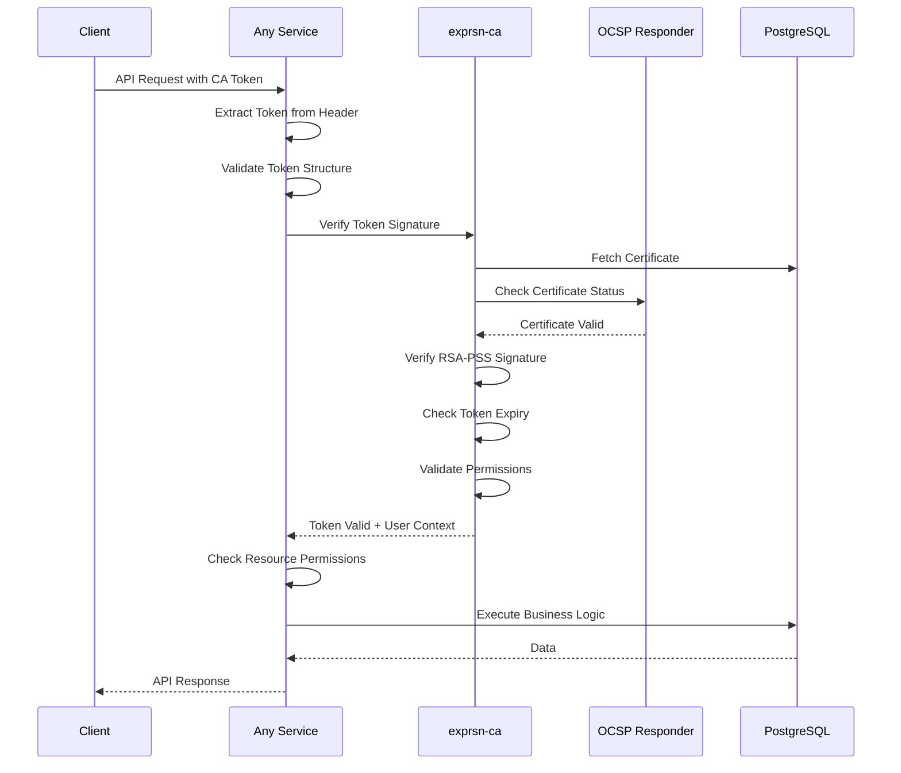

## Service-to-Service Communication Pattern

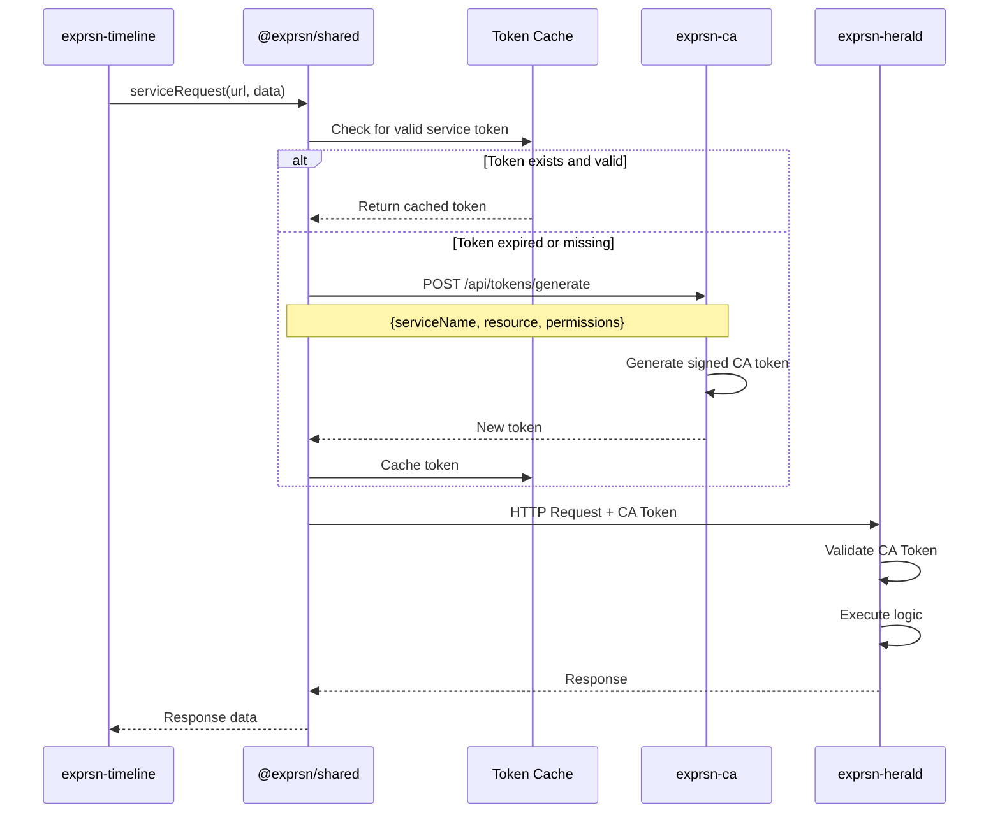

## Low-Code Platform Architecture

```mermaid
graph TB
    subgraph "Low-Code Platform (exprsn-svr:5000)"
        LCMAIN[Platform Home<br/>/lowcode]
        APPD[App Designer<br/>/lowcode/designer]
        ENTD[Entity Designer<br/>/lowcode/entities/new]
        GRIDD[Grid Designer<br/>/lowcode/grids/new]
        FORMD[Form Designer<br/>/lowcode/forms/new]
    end

    subgraph "Form Designer Components (7 Modules)"
        FD_CORE[FormDesigner<br/>Core Engine<br/>4-Panel IDE]
        FD_DATA[DataBindingManager<br/>Entity/REST/JSONLex/Custom]
        FD_EVENT[EventHandlerManager<br/>7 Event Types]
        FD_PERM[PermissionsManager<br/>Form & Component Level]
        FD_WF[WorkflowIntegration<br/>Trigger Workflows]
        FD_FORGE[ForgeIntegration<br/>CRM Integration]
        FD_GRID[GridRuntimeRenderer<br/>Dynamic Grids]
    end

    subgraph "Component Library (27 Components)"
        BASIC[Basic: 12<br/>Input/Button/Label/etc]
        DATA[Data: 5<br/>Entity Picker/CRUD/Subgrid]
        LAYOUT[Layout: 5<br/>Container/Tabs/Accordion]
    end

    subgraph "Data Layer"
        LC_DB[(exprsn_svr DB)]
        MODELS[Low-Code Models<br/>Application/Entity<br/>EntityField/Grid<br/>Form/Resource]
    end

    subgraph "Services"
        ENTITY_SVC[EntityService<br/>CRUD Operations]
        GRID_SVC[GridService<br/>Rendering & Data]
        FORM_SVC[FormService<br/>Operations]
        JSONLEX[JSONLexService<br/>Expression Evaluation]
    end

    subgraph "Integration Points"
        INT_WF[exprsn-workflow<br/>Port 3017]
        INT_FORGE[exprsn-forge<br/>Port 3016]
        INT_AUTH[exprsn-auth<br/>Port 3001]
    end

    LCMAIN --> APPD
    LCMAIN --> ENTD
    LCMAIN --> GRIDD
    LCMAIN --> FORMD

    FORMD --> FD_CORE
    FD_CORE --> FD_DATA
    FD_CORE --> FD_EVENT
    FD_CORE --> FD_PERM
    FD_CORE --> FD_WF
    FD_CORE --> FD_FORGE
    FD_CORE --> FD_GRID

    FD_CORE --> BASIC
    FD_CORE --> DATA
    FD_CORE --> LAYOUT

    APPD --> MODELS
    ENTD --> ENTITY_SVC
    GRIDD --> GRID_SVC
    FORMD --> FORM_SVC

    MODELS --> LC_DB
    ENTITY_SVC --> LC_DB
    GRID_SVC --> LC_DB
    FORM_SVC --> LC_DB

    ENTITY_SVC --> JSONLEX
    GRID_SVC --> JSONLEX
    FORM_SVC --> JSONLEX

    FD_WF --> INT_WF
    FD_FORGE --> INT_FORGE
    FD_PERM --> INT_AUTH

    style FD_CORE fill:#845ef7,stroke:#5f3dc4,color:#fff
    style JSONLEX fill:#20c997,stroke:#099268,color:#fff
    style LC_DB fill:#339af0,stroke:#1864ab,color:#fff
```

## Database Architecture (Database-Per-Service)

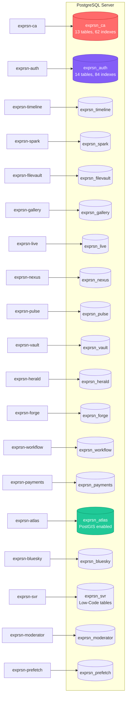

## Payment Processing Flow

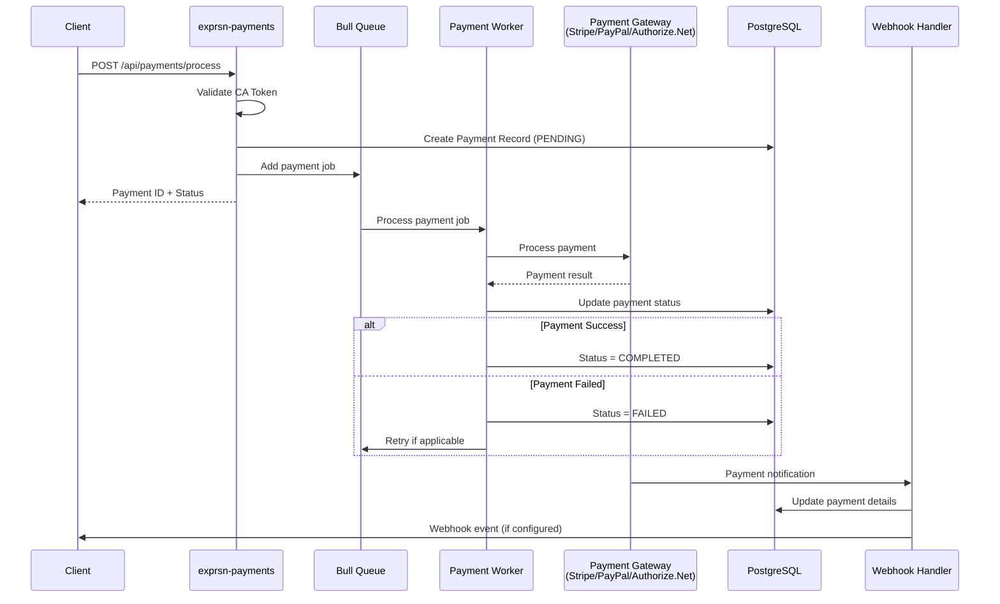

## Workflow Execution Flow

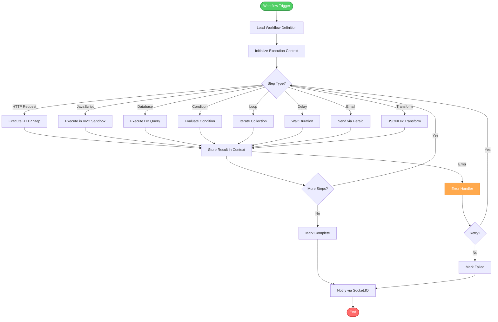

## SAML 2.0 Authentication Flow

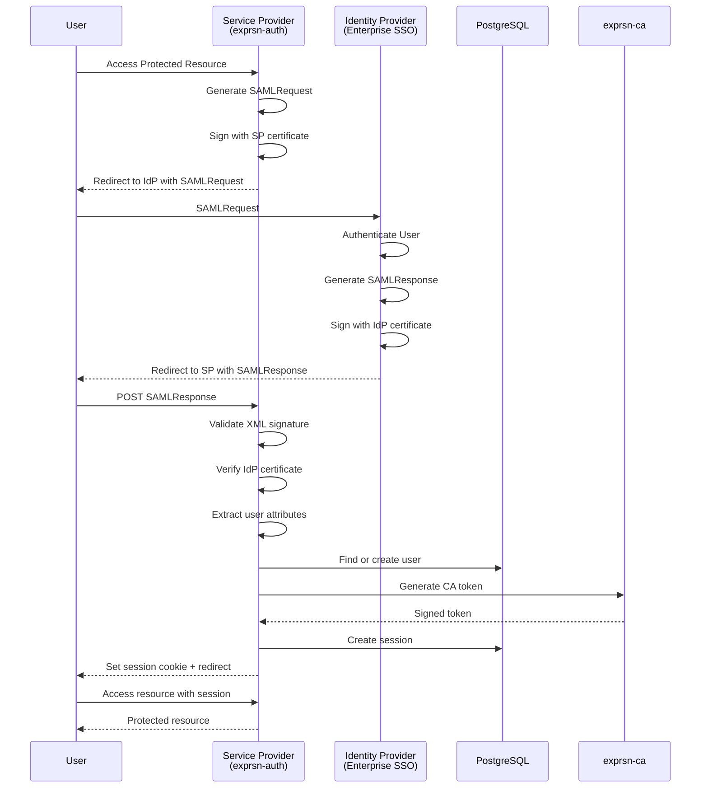

## Real-time Messaging Architecture (Spark)

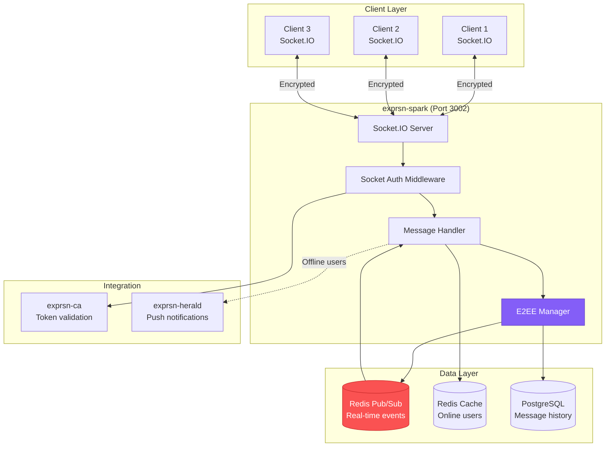

## Timeline Feed Generation (Fan-out Pattern)

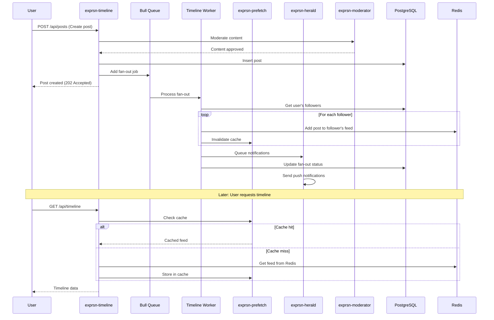

## Deployment Architecture

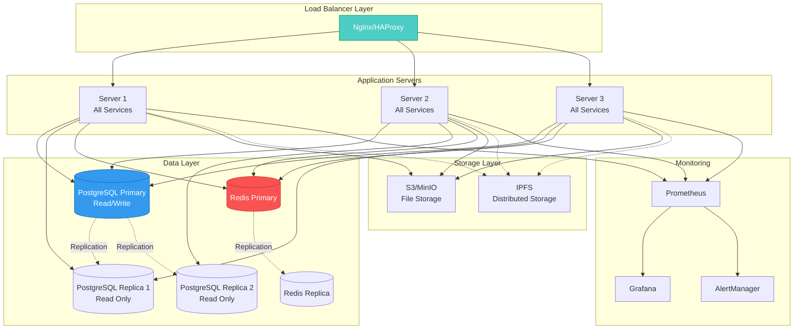

---

## Legend

- **Solid lines** = Direct dependencies/communication
- **Dashed lines** = Optional or external integrations
- **Red services** = Critical infrastructure (CA)
- **Blue databases** = Data persistence layer
- **Purple services** = Authentication/Security
- **Green services** = External integrations
